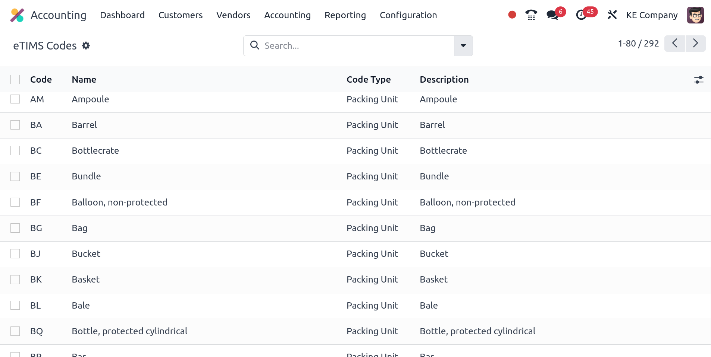

=====
Kenya
=====

.. _localization/kenya/configuration:

Configuration
=============

Install the 🇰🇪 **Kenyan** fiscal localization package :ref:`fiscal localization package
<fiscal_localizations/packages>` to get all the features of the Kenyan localization.

eTIMS
=====

The `Kenya Revenue Authority (KRA) <https://www.kra.go.ke/>`_ has decided to go digital for tax
collection through the `electronic Tax Invoice Management System (eTIMS)
<https://www.kra.go.ke/online-services/etims>`_.

Odoo has developed an :abbr:`OSCU (Online Sales Control Unit)` that integrates with the existing
**Trader Invoicing System (TIS)**. The OSCU performs the validation, encryption, signing,
transmission, and storage of tax invoices.

.. note::
   Make sure to install the **Kenya eTIMS EDI** modules to make full use of the OSCU device.

OSCU device initialization
--------------------------

Users must initialize their OSCU before they can use it. Before initialization, navigate to
:guilabel:`Odoo Database --> Settings --> General Settings`, click :guilabel:`Update Info` and in
the :guilabel:`General Information` tab, enter your tax ID in the :guilabel:`Tax ID` field.

To  intitialize the OSCU, go to the :guilabel:`eTIMS` tab. Fill in the :guilabel:`eTIMS Branch Code`
and :guilabel:`Serial Number` of the device. Make sure to set :guilabel:`eTIMS Server Mode` to
:guilabel:`Test` for the initialization. When done, tick the **user agreement** and click
:guilabel:`Initialize OSCU`. Your device is now authenticated.

.. note::
   Three :guilabel:`Server Mode` are available:

   - :guilabel:`Demo`: Uses mocked data and does not require an initialized OSCU. Serves demo
     purposes;
   - :guilabel:`Test`: Used to test the connection to eTIMS;
   - :guilabel:`Production`: Used for live databases ready to send data.

.. Important::
   If your device has **already been authenticated** (through another ERP, for example), enable
   :doc:`../../general/developer_mode` and go to the :guilabel:`eTIMS` tab. The field
   :guilabel:`Device Communication Key` is now available. Enter the key obtained through a previous
   authentication, :guilabel:`Save manually`, and click :guilabel:`Initialize OSCU`. It **may take
   time** before the button is available as the initialization was made elsewhere before.

eTIMS codes
-----------

Common standard codes are **automatically** fetched from the KRA eTIMS API servers every **two
days**. These can be fetched **manually** by enabling :doc:`../../general/developer_mode` and going
to :menuselection:`Settings --> Technical --> Automation: Scheduled Actions -->
KE eTIMS: Fetch KRA standard codes`. Here, click :guilabel:`Run Manually` to fetch the codes.

The complete list of fetched OSCU codes can be found under :menuselection:`Accounting -->
Configuration --> KE OSCU Codes`.

UNSPSC codes
------------

UNSPSC codes are **automatically** fetched from the KRA eTIMS API servers **every day**. The codes
are **needed by the KRA** for a product to be **registered**. These codes can be **manually**
fetched by enabling :doc:`../../general/developer_mode` and going to :menuselection:`Settings -->
Technical --> Automation: Scheduled Actions --> KE eTIMS: Fetch UNSPSC codes from eTIMS`. Here,
click :guilabel:`Run Manually` to fetch the codes.

The complete list of fetched UNSPSC codes can be found under :menuselection:`Accounting -->
Configuration --> KE OSCU Codes`.

Notices
-------

Notices are **automatically** fetched from the KRA eTIMS API servers **every day**. These notices
can be fetched **manually** by enabling :doc:`../../general/developer_mode` and going to
:menuselection:`Settings --> Technical --> Automation: Scheduled Actions --> KE eTIMS: Fetch KRA
notices from eTIMS`. Here, click :guilabel:`Run Manually` to fetch the codes.

The complete list of fetched notices can be found under :menuselection:`Accounting --> Configuration
--> KE OSCU Notices`.

Multi-company
-------------

.. _kenya/branch:

.. seealso::
   :doc:`../../general/companies`

The ID of a company can be configured under the **Settings** app, click :guilabel:`Update Info` in
the **Companies** section, and finally click the :guilabel:`eTIMS` tab. In a multi-company
environment, the **main company** has a branch ID equal to `00`. Companies that are *not* the main
company have a branch ID other than `00` and are assigned an ID **by the KRA**.

.. note::
   The KRA considers that each **place of supply** corresponds to a branch (ID).

Fetch branch ID from the KRA
~~~~~~~~~~~~~~~~~~~~~~~~~~~~

In the **Settings** app, under :guilabel:`Update Info` in the **Companies** section, *if* the
**main company** has a Kenyan :guilabel:`Tax ID` and the **OSCU** device has been initialized, users
can fetch **branch information** from the KRA for their non-main companies. To do so, click the
:guilabel:`Branches` and then :guilabel:`Populate from KRA`. Once the information fetched, branches
for this **main company** can be created.

.. note::
   The **OSCU** device must be **initialized independently** for each branch.

Partner branch ID
-----------------

When creating a **new partner** or modifying an **existing partner**, a **branch code** can be
attributed to that partner. To do so, go to :menuselection:`Accounting --> Customers --> Customers`
or :menuselection:`Vendors --> Vendors`, click a partner, and in the :guilabel:`Accounting` tab,
enter a **branch code** in the :guilabel:`eTIMS Branch Code` field.

.. note::
   By default, partners' branch code are to `OO`.

KRA Sequences
-------------

.. important:
   Odoo invoice sequences and KRA sequences are **different**.

In Odoo, invoice sequences depend on the **parent (main) company**. Parent companies can see the
invoices of branches, but branches **cannot** see the parent company's invoices, nor those of other
branches.

.. example::
   If you have a **main** company with **two branches**, the invoice sequence would be the
   following:

   - Creating an invoice on **branch 1**: INV/2024/00001
   - Creating an invoice on **branch 2**: INV/2024/00002
   - Crating on invoice on **parent company**: INV/2024/00003

The KRA, however, needs **independant** sequences per branches. Odoo therefore manages sequences per
branch **individually**.

.. example::
   This is how Odoo manages sequences to be compliant with the KRA regulations:

   - Creating an invoice on **branch 1**: INV/2024/00001
   - Creating an invoice on **branch 2**: INV/2024/00001
   - Creating an invoice on **parent company**: INV/2024/00001

Insurance
=========

For **health service providers**, users can send **insurance information** of the main and branch
offices and update it in eTIMS. To do so, open the **Settings** app, click :guilabel:`Update Info`
in the **Companies** section, and in the :guilabel:`eTIMS` tab, fill in the fields related to your
company: :guilabel:`Insurance Code`, :guilabel:`Insurance Name`, and :guilabel:`Insurance Rate`.

Items registration
==================

The KRA requires products to be registered first before any business opertations (such as stock
movements, :abbr:`BOM (Bill of Materials)`, customer invoices, etc.). In order to be registered,
each product must have the following elements defined. These can be found under the
:guilabel:`General Information` tab of a **product form view** (:menuselection:`Accounting -->
Customers --> Products` or :menuselection:`Accounting --> Vendors --> Products`).